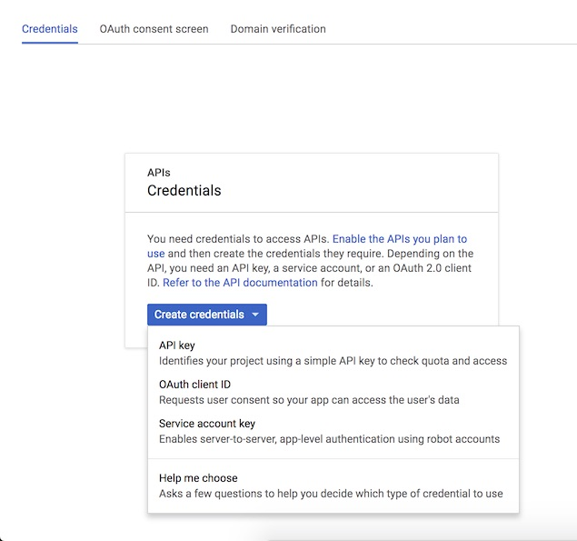
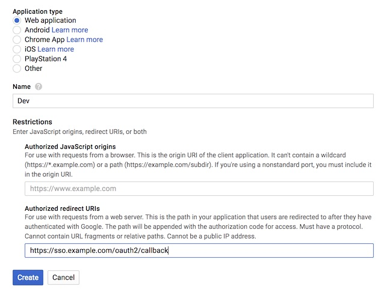
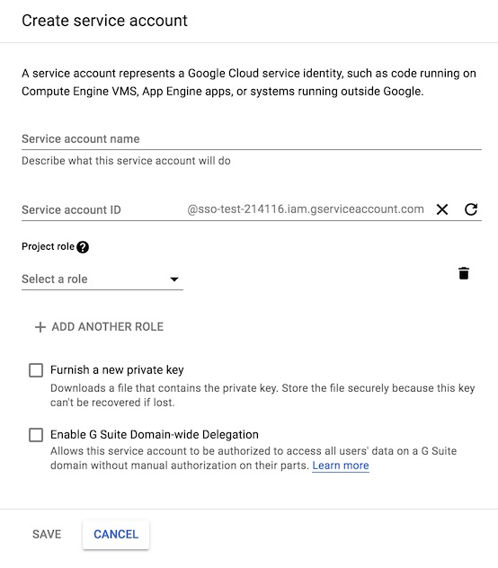
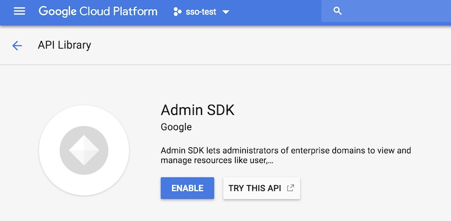

# Google Provider Setup & Configuration

**sso** uses Google as its authoritative OAuth provider, and there are some
manual steps that must be followed to create and configure the necessary
credentials.

## 1. Create a Google Cloud project

Use a web browser to access the Google Cloud [Resource Manager](
https://console.developers.google.com/cloud-resource-manager). Log into your account, if you have
not already done so.

Select "Create Project". Provide the requested details (Project Name, etc), and click "Create". You
will have a notification when your project has finished being created; this should only take a
few moments.

## 2. Generate OAuth credentials

Once your project has been created, click [here](
https://console.cloud.google.com/apis/credentials/consent) to configure the "OAuth consent screen"
for your project. Make sure that the name of the project you have created appears next to the words
"Google Cloud Platform" in the toolbar at the top of the website; if it does not, switch to your
project by clicking the name that appears there, and selecting the project you just created.

Fill in the field "Product name shown to users". We recommend the name `SSO Authenticator` for this
field. Hit "Save" after filling in this field.

After this, click [here](https://console.cloud.google.com/apis/credentials) to configure
credentials for the service. Click the button labeled "Create credentials", and select the option
"OAuth client ID".

The next screen will ask you to choose an "Application Type"; select "Web application". You will be
asked to fill in three fields.
- **Name**: Any appropriate name is fine (e.g. `Dev`).
- **Authorized JavaScript origins**: Leave this field blank.
- **Authorized redirect URIs**: Add the URI of your `sso-auth` deployment, with the path suffix
`/google/callback`. For example, if `sso-auth` will  be accessible at the domain
`sso-auth.example.com`, then add the URI `https://sso-auth.example.com/google/callback`.

**⚡️ Note:** If you're following the [Quickstart guide](quickstart.md), use
`http://sso-auth.localtest.me` as the Authorized redirect URI.

Once all of this has been entered, click the "Create" button. A dialog box will open with two
fields, a "client ID" and a "client secret". Copy both of these values to a safe and secure
location before clicking the "OK" button to proceed. The "client ID" and "client secret" strings
will be used to configure your `sso` deployment, as described below.

**⚡️ Note:** If you're following the [Quickstart guide](quickstart.md), **stop here!**
You'll add these credentials to `quickstart/env` as instructed in [the guide](quickstart.md).

## 3. Set up a service account for Google Groups-based authorization

If desired, `sso` can be configured to use Google Groups membership for authorization, only granting
access to an upstream to users that are members of particular groups. *Note*: Nested groups are currently only supported up to a maximum depth of 4.

### Create a service account

Begin by creating a "service account". This will be the identity assumed by `sso` when requesting
information about a user from Google. Go to the [Service Accounts] page in IAM/Admin, and verify
that the correct project name appears in the dashboard at the top of the page before proceeding.
Click "Create Service Account" toward the top of the page to begin creating the account.

Fill out the fields requested as follows:
- **Service account name**: Any appropriate name is fine. We recommend `sso-authenticator`.
- **Service account ID**: Google will generate this as you type the "account name". We recommend
leaving as-is.
- **Project role**: No project roles are required for `sso`.
- **Furnish a new private key**: Check this box, and select `JSON` as the "Key type".
- **Enable G Suite Domain-wide Delegation**: Check this box.

Click the "Save" button after entering this information. Google will download a `.json` file
through your browser containing a private key. Make sure not to lose this.

In the [Credentials](https://console.cloud.google.com/apis/credentials) page, you should now see
the service account that you just created listed under "OAuth 2.0 client IDs". Copy the "Client ID",
as it will be used in the next step.

### Authorizing use of the Admin SDK API

Click [here](https://console.cloud.google.com/apis/library/admin.googleapis.com) to go to Google's
page for the "Admin SDK" API. Click "Enable" to enable the API for your project. Note that if the
API has already been enabled on your project, then you will see the word "API enabled" along with
a green checkmark.

Go to the [Google Admin console](https://admin.google.com); note that you may be prompted to log
in again. Select "Security" from the available controls (click "More Controls" if it is not visible
when the page first loads).

Click the "Advanced settings" option, and select "Manage API client access" from the resulting
panel.

In the "Client Name" field, enter the Client ID of the service account that you have created. You
will need to provide the following "API Scopes" for the service account that we have created:
- `https://www.googleapis.com/auth/admin.directory.group.readonly`
- `https://www.googleapis.com/auth/admin.directory.user.readonly`

Type these into the field titled "One or More API Scopes", as a comma-separated list. After these
have been filled in, click the "Authorize" button.

### Configuring `sso` to use the service account credentials

To give `sso-auth` permission to access Google Group information for users, the following
environment variables must be set:

NOTE: `GOOGLEQUICKSTART` is a logical identifier that is used to group the configuration
variables together for any one provider. This can be changed to an identifier that makes
sense for your individual use case.
If following the quickstart, make sure this identifier matches what you used there.

- **`PROVIDER_GOOGLEQUICKSTART_GOOGLE_IMPERSONATE`**: An administrative email address on your organization's
domain, the identity of which can be assumed by `sso`.
- **`PROVIDER_GOOGLEQUICKSTART_GOOGLE_CREDENTIALS`**: The path to the JSON file downloaded at the time of
service account creation above. There is no reason why this file should ever be accessed by any
person or service other than `sso`; ensure that file permissions are set accordingly.
